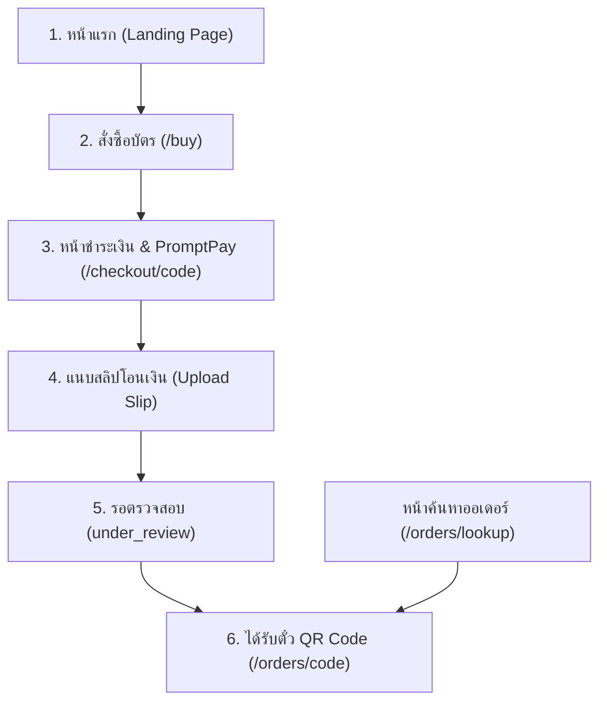

# สเปก UX/UI เว็บไซต์จำหน่ายบัตร “งานลาบแรกพบ” (UX/UI Specification)

> **เอกสารอ้างอิง:** ฉบับสมบูรณ์สำหรับทีมพัฒนาและดีไซเนอร์  
> **ภาษาของระบบ:** ข้อความที่แสดงผลต่อผู้ใช้งานเป็นภาษาไทย 100% (สุภาพ ตรงไปตรงมา กระชับ)  
> **แนวคิดหลัก:** เรียบมินิมอล (Minimalist) • เน้นธุรกรรม (Transaction-focused) • ออกแบบมือถือก่อน (Mobile-First) พร้อมขยายเต็มประสิทธิภาพบนเดสก์ท็อป (Desktop Optimized)

---

## 1. แนวทางการออกแบบและ Design System (Design Tokens)

### 1.1 ชุดสีหลัก (Color Palette)

| บทบาทสี | ค่าสี (HEX) | การใช้งาน |
|---|---|---|
| **Primary Accent (แดงเข้ม)** | `#8F1D2D` | ปุ่มสั่งซื้อหลัก (CTA), ตัวเลขราคาบัตร, ไอคอนเน้น, แถบสถานะสำคัญ |
| **Primary Hover / Active** | `#751724` | สถานะ Hover และ Active ของปุ่มหลัก |
| **Primary Subtle (พื้นหลังแดงอ่อน)** | `#FDF2F4` / `rgba(143, 29, 45, 0.08)` | พื้นหลัง Badge, ไฮไลต์กล่องข้อมูลสำคัญ, ขอบบาง |
| **Surface Base (พื้นหลัก)** | `#FFFFFF` | พื้นหลังของหน้าจอหลักและเนื้อหา |
| **Surface Subtle (พื้นรอง)** | `#F8FAFC` / `#F1F5F9` | พื้นหลังแบ่งกลุ่มข้อมูล (Grouping), พื้นหลังช่องกรอก (Input Background) |
| **Border / Divider (เส้นขอบ)** | `#E2E8F0` / `#CBD5E1` | เส้นคั่นส่วนเนื้อหา, เส้นขอบกล่อง (บางและคมชัด 1px) |
| **Text Primary (ข้อความหลัก)** | `#0F172A` | หัวข้อ, ตัวเลขจำนวนเงิน, ตัวหนังสือสำคัญ (คอนทราสต์สูง อ่านง่ายทุกสภาพแสง) |
| **Text Secondary (ข้อความรอง)** | `#475569` | คำอธิบาย, ป้ายกำกับช่องกรอก (Labels), วันและเวลา |
| **Text Muted (ข้อความเสริม)** | `#94A3B8` | หมายเหตุย่อย, ตัวเลขนับถอยหลัง, Placeholder |
| **Status Success (เขียว)** | `#16A34A` / `#DCFCE7` | อนุมัติสำเร็จ, ชำระเงินครบแล้ว, เช็กอินสำเร็จ |
| **Status Warning (เหลืองส้ม)** | `#D97706` / `#FEF3C7` | รอตรวจสลิป, ยอดเงินยังไม่ครบ, นับถอยหลังใกล้หมด |
| **Status Danger (แดงเตือน)** | `#DC2626` / `#FEE2E2` | สลิปซ้ำ, สลิปถูกปฏิเสธ, สแกนตั๋วซ้ำ, ร้านเต็มชั่วคราว |

---

### 1.2 ตัวอักษรและระยะห่าง (Typography & Spacing)

- **แบบอักษร (Font Family):** `Noto Sans Thai`, sans-serif (รองรับสระและวรรณยุกต์ไทยสมบูรณ์ ไม่ลอย ไม่ซ้อนทับ)
- **สเกลตัวอักษร:**
  - **Display (Hero):** 28px - 32px / Bold (700) — ชื่องาน, ยอดเงินหลัก
  - **Heading 1:** 20px - 24px / Bold (700) — หัวข้อหน้าจอ
  - **Heading 2:** 16px - 18px / Semi-bold (600) — หัวข้อกลุ่มข้อมูล
  - **Body Regular:** 14px - 15px / Regular (400) — คำอธิบายและเนื้อหา
  - **Body Small / Meta:** 12px - 13px / Regular (400) — หมายเหตุ, ป้ายบอกสถานะ
  - **Monospace:** `JetBrains Mono`, `Courier New` — รหัสคำสั่งซื้อ (`LRP-XXXXXX`), รหัสตั๋ว
- **ความโค้งมน (Border Radius):**
  - ปุ่มและช่องกรอก: `12px` (rounded-xl)
  - กล่องข้อมูลและภาพสลิป: `16px` (rounded-2xl)
  - Modal / Bottom Sheet บนมือถือ: `24px` ด้านบน (rounded-t-3xl)
- **หลีกเลี่ยงการทำทุกอย่างเป็นการ์ด (Card-Fatigue):** ใช้วิธีแบ่งกลุ่มด้วยระยะห่าง (Spacing) และเส้นคั่นสีเทาอ่อน `1px` แทนการซ้อนกล่องการ์ดหลายชั้น

---

## 2. โครงสร้างเส้นทางผู้ซื้อ (Buyer Journey & Wireframe Specs)

---

### 2.1 หน้าแรก (Landing Page: `/`)
- **เป้าหมาย:** สื่อสารชื่องาน วันที่ สถานที่ ราคาบัตร 20 บาทอย่างชัดเจนที่สุด และมีปุ่ม CTA ซื้อบัตรทันที
- **โครงสร้างข้อมูล:**
  1. **Top Bar:** โลโก้งาน "งานลาบแรกพบ", วันที่จัดงาน `9 พ.ย. 2569`, ลิงก์ "ค้นหาบัตรของฉัน"
  2. **Hero Section:**
     - ชื่องาน: **งานลาบแรกพบ**
     - สถานที่: **ร้านลาบก้อยซอยนานา (หลัง ม.ข.)**
     - เวลาเปิดประตู: **16:00 น. เป็นต้นไป**
     - ป้ายราคาเด่น: **บัตรเข้างาน 20.- / คน**
     - ปุ่มหลัก (Primary CTA): `ซื้อบัตรเข้างาน (20 บาท)` สีแดงเข้ม `#8F1D2D` กว้างเต็มจอมือถือ
  3. **ภาพบรรยากาศงานจริง:** กรอบภาพมุมโค้งมน แสดงภาพถ่ายจริงของร้านและวงดนตรี (ไม่มีภาพกราฟิกสังเคราะห์)
  4. **ขั้นตอนง่ายๆ 3 สเต็ป:** 1. เลือกจำนวนบัตร 2. สแกนจ่ายพร้อมเพย์ 3. แนบสลิป รอรับ QR เข้างาน
  5. **Footer:** นโยบายความเป็นส่วนตัว (PDPA), เงื่อนไขบัตร (ไม่สามารถขอคืนเงินได้)

---

### 2.2 หน้าสั่งซื้อบัตรแบบแบ่งขั้น (Buy Tickets: `/buy`)
- **เป้าหมาย:** ทำรายการสั่งซื้อสะดวกรวดเร็ว ไม่สับสน รองรับผู้ซื้อทุกช่วงวัย
- **การแบ่งขั้นตอน (Stepped Flow):**
  - **ขั้นที่ 1: เลือกจำนวนบัตร**
    - ตัวปรับจำนวนบัตร `[-]` `จำนวน` `[+]` ปุ่มใหญ่ กดง่ายด้วยนิ้วโป้ง
    - ขั้นต่ำ 1 ใบ, เพดานระบบ 100 ใบ
    - กล่องสรุปยอดรวม: แสดงยอดเงินตัวใหญ่ชัดเจน (เช่น `40 บาท` สำหรับ 2 ใบ)
  - **ขั้นที่ 2: ข้อมูลผู้ซื้อและการยินยอม**
    - ชื่อ - นามสกุลจริง (สำหรับยืนยันรับ Wristband หน้างาน)
    - เบอร์โทรศัพท์มือถือ 10 หลัก (ตรวจจับรูปแบบ `0XXXXXXXXX` แบบเรียลไทม์)
    - อีเมล (ตรวจจับรูปแบบอีเมล พร้อมข้อความแจ้งเตือนภาษาไทยในฟอร์ม ปิด Native Browser Tooltip)
    - ช่องทางติดต่อสำรอง (LINE ID / Facebook — ไม่บังคับ)
    - **Checkboxes ยินยอม 2 ข้อ (ต้องติ๊กทั้งสองข้อ):**
      - [ ] ยอมรับว่าบัตรเข้างานไม่สามารถขอคืนเงินได้ทุกกรณี
      - [ ] ยินยอมให้ใช้ข้อมูลเพื่อยืนยันตัวตนในการรับสายรัดข้อมือเข้างาน
  - **ขั้นที่ 3: สรุปความถูกต้องก่อนสร้างออเดอร์**
    - แสดงตารางสรุปชื่อ, จำนวนบัตร, ยอดเงินที่ต้องชำระ
    - ปุ่มกดยืนยัน: `ยืนยันการสั่งซื้อและไปชำระเงิน`

---

### 2.3 หน้าชำระเงินและแนบสลิป (`/checkout/[code]`)
- **เป้าหมาย:** อำนวยความสะดวกในการโอนเงิน ลดข้อผิดพลาดในการใส่ยอดเงิน
- **องค์ประกอบสำคัญ:**
  1. **Order Header:**
     - รหัสคำสั่งซื้อแบบตัวพิมพ์ใหญ่และตัวเลข (เช่น `LRP-EA8AC3`) พร้อมปุ่มคัดลอก
     - ป้ายสถานะ: `รอชำระเงิน` (สีส้ม)
     - ตัวเลขนับถอยหลัง 30 นาที (Realtime Countdown)
  2. **ยอดเงินและ PromptPay QR:**
     - ยอดเงินตัวหนาขนาดใหญ่: `฿20.00`
     - ภาพ **PromptPay QR Code** ที่ฝังยอดเงินที่ต้องชำระไว้พอดี (สแกนผ่านแอปธนาคารแล้วยอดขึ้นอัตโนมัติ)
     - ปุ่มดาวน์โหลด/บันทึกรูป QR Code ลงเครื่อง
  3. **ข้อมูลบัญชีธนาคาร (ทางเลือกโอนเลขบัญชี):**
     - ธนาคารกสิกรไทย (KBANK)
     - ชื่อบัญชี: **นายรามณรงค์ชัย จันต๊ะภา**
     - เลขที่บัญชี: **2218954758** พร้อมปุ่มคัดลอกแบบ One-tap
  4. **ฟอร์มแนบสลิปโอนเงิน (Slip Upload Box):**
     - รองรับการแตะเพื่อเลือกรูปจากคลังภาพหรือถ่ายภาพสลิป
     - ช่องระบุยอดเงินที่โอน (ค่าเริ่มต้นเติมยอดคงเหลือให้อัตโนมัติ)
     - ช่องระบุเวลาที่โอน และธนาคารต้นทาง
     - รองรับการแบ่งจ่าย (Split-payment): หากโอนมาไม่ครบ ยอดจะหักออกและแสดงยอดคงเหลือให้โอนเพิ่มได้

---

### 2.4 หน้าดูสถานะออเดอร์และตั๋วเข้างาน (`/orders/[code]`)
- **สถานะที่ 1: รอตรวจสอบสลิป (`under_review`)**
  - แสดงแบนเนอร์สีเหลืองส้ม "เราได้รับสลิปของคุณแล้ว สตาฟกำลังตรวจสอบข้อมูล"
  - มีประวัติสลิปที่แนบเข้ามา พร้อมเวลาที่ส่ง
- **สถานะที่ 2: ชำระเงินเรียบร้อยแล้ว (`paid`)**
  - แบนเนอร์สีเขียว "ชำระเงินสำเร็จ — พร้อมเข้างาน"
  - **การ์ดตั๋ว QR Code:** แสดงตั๋วแยก 1 ใบต่อ 1 คน
    - รหัสตั๋ว (Ticket Code)
    - QR Code ความละเอียดสูง คอนทราสต์ขาวดำ คมชัดสแกนง่ายในที่มืดหรือแสงสะท้อน
    - ปุ่ม **"บันทึกภาพตั๋ว"** ลงในอัลบั้มมือถือ

---

### 2.5 หน้านโยบายความเป็นส่วนตัว (`/privacy`)
- แสดงข้อมูลตามหลัก PDPA ภาษาไทย: ประเภทข้อมูลที่จัดเก็บ, วัตถุประสงค์ในการออกบัตรและแจกสายรัดข้อมือ, ระยะเวลาจัดเก็บข้อมูล (30 วันหลังสิ้นสุดงาน), และช่องทางการติดต่อผู้จัดงาน

---

## 3. โครงสร้างเส้นทางสตาฟและแอดมิน (Staff & Admin Experience)

### 3.1 หน้าเข้าสู่ระบบด่วนด้วย PIN (`/admin/login`)
- ออกแบบสำหรับหน้างานที่มีความเร่งด่วน:
  - หน้าป้อนตัวเลข PIN (Virtual Numeric Keypad) 4 หลัก
  - แยกบทบาทอัตโนมัติ:
    - **Admin PIN (`8899`):** เข้าถึงได้ทุกฟังก์ชัน (ตรวจสลิป, แก้ไขยอด, จัดการออเดอร์, ดูสถิติ, สวิตช์ร้านเต็ม)
    - **Staff PIN (`1122`):** เข้าสู่โหมดสแกนบัตรหน้าประตู (`/staff/scan`) โดยตรง
  - บันทึก Session ปลอดภัยใน HttpOnly Cookie (ป้องกันไม่ให้บุคคลภายนอกเปิดดูคิวสลิปหรือข้อมูลผู้ซื้อได้)

---

### 3.2 หน้าคิวรอตรวจสลิป (`/admin`)
- แสดงจำนวนคิวรอตรวจสลิป (เช่น `รอตรวจ (3)`)
- สวิตช์เปิด/ปิดเสียงแจ้งเตือนเมื่อมีสลิปใหม่ (Beep Audio)
- โพลลิงอัตโนมัติทุก 5 วินาที
- การ์ดรายการสลิปแสดง: รหัสออเดอร์, ยอดเงิน, เวลาโอน, ชื่อผู้โอน, แถบเตือนสีแดงหากเป็นสลิปที่ตรวจพบ SHA-256 ซ้ำ

---

### 3.3 Modal ตรวจสลิป (Slip Review Modal)
- **ภาพสลิปจริง:** แสดงภาพสลิปที่ดึงมาจาก Supabase Storage โดยตรง
- ปุ่มเปิดดูภาพสลิปขนาดเต็ม (Full-screen Lightbox)
- **ข้อมูลเปรียบเทียบ:** ยอดที่แจ้ง vs ยอดที่ต้องชำระ
- **ปุ่มดำเนินการ (Thumb-friendly):**
  - ปุ่มสีเขียว: `อนุมัติ (฿20.00)`
  - ลิงก์แก้ไขยอด: หากยอดในสลิปไม่ตรง สามารถกดพิมพ์ยอดเงินที่โอนจริงก่อนอนุมัติได้
  - ปุ่มสีแดง: `ปฏิเสธสลิป` (พร้อมตัวเลือกเหตุผล: สลิปไม่ชัด, ยอดไม่ตรง, สลิปซ้ำ, บัญชีปลายทางไม่ถูกต้อง)

---

### 3.4 หน้าสแกนบัตรหน้าประตู (`/staff/scan`)
- ช่องเปิดกล้องสแกน QR Code แบบเรียลไทม์
- **ผลลัพธ์การสแกน (Full-screen Feedback):**
  - **ผ่าน (สีเขียว):** "เช็กอินสำเร็จ — แจก Wristband แล้ว" แสดงชื่อผู้ถือบัตร และรหัสออเดอร์ พร้อมเสียงติ๊ดสั้น
  - **ซ้ำ (สีแดงกระพริบ):** "บัตรนี้เข้างานไปแล้ว!" แสดงวันเวลาและชื่อสตาฟที่สแกนไปก่อนหน้านี้ชัดเจน
  - **ไม่ถูกต้อง (สีส้ม):** "ไม่พบรหัสบัตรในระบบ"
- มีช่องพิมพ์รหัสค้นหาด้วยตนเอง (Manual Fallback) สำหรับกรณีกล้องมือถือลูกค้าหน้าจอแตกหรือแสงสะท้อน

---

## 4. สถานะสำคัญและกรณีผิดพลาด (Error & Edge Cases Specs)

| กรณีผิดพลาด | พฤติกรรมของระบบ | ข้อความที่แสดงผลบนหน้าจอ |
|---|---|---|
| **โอนเงินไม่ครบ** | อนุมัติตามยอดจริง หักลบยอด ออเดอร์ยังไม่เป็น `paid` | แสดงยอดคงเหลือที่ต้องชำระเพิ่ม พร้อม QR Code ใหม่ตามยอดส่วนต่าง |
| **สลิปซ้ำ (Duplicate Slip)** | ระบบตรวจจับ SHA-256 ซ้ำ ขึ้นแถบเตือนสีแดงในหน้าแอดมิน | "คำเตือน: พบสลิปที่มีข้อมูลซ้ำในระบบ (เคยถูกใช้ในออเดอร์ LRP-XXXXXX)" |
| **ออเดอร์เกิน 30 นาที** | ผู้ซื้อยังสามารถแนบสลิปได้ตามปกติ (ไม่บล็อกสลิปจริง) | "หมดเวลานับถอยหลัง แต่คุณยังสามารถแนบสลิปเพื่อให้สตาฟตรวจสอบได้" |
| **ร้านเต็มชั่วคราว** | แอดมินกดเปิดสวิตช์ร้านเต็ม หน้าสั่งซื้อจะถูกปิด | "ร้านเต็มชั่วคราว — กรุณารอสักครู่ หรือสอบถามสตาฟหน้างาน" (ปุ่มซื้อกดไม่ได้) |
| **สแกนตั๋วซ้ำ** | ปฏิเสธการเข้างานทันที | "บัตรนี้เข้างานแล้วเมื่อ [เวลา] (โดย [ชื่อสตาฟ])" |
| **ไม่อนุญาตเปิดกล้อง** | แสดงคำแนะนำการเปิดสิทธิ์กล้องในเบราว์เซอร์ | มีปุ่มสลับไปใช้ช่องค้นหารหัสบัตรด้วยตนเองแทน |
| **เน็ตช้า / ตัดการเชื่อมต่อ** | แสดงสถานะกำลังพยายามเชื่อมต่อใหม่ ไม่ทำให้ออเดอร์สูญหาย | "กำลังเชื่อมต่อระบบ กรุณารอสักครู่..." |

---

## 5. การรองรับหน้าจอคอมพิวเตอร์ (Desktop 1280px Optimization)

- **หน้าแรก (Landing):** จัดเนื้อหาแบบ Wide Hero สองฝั่ง — ฝั่งซ้ายเป็นข้อมูลงาน วันเวลา และปุ่มสั่งซื้อ; ฝั่งขวาเป็นภาพบรรยากาศงานและราคาบัตร
- **หน้าสั่งซื้อ (`/buy`):** จัดเป็น Two-Column Layout — ฝั่งซ้ายเป็นการ์ดสรุปรายการบัตรและแผนที่ร้าน; ฝั่งขวาเป็นฟอร์มกรอกข้อมูลผู้ซื้อ
- **หน้าแอดมิน (`/admin`):** แสดงแบบ Master-Detail Layout — ฝั่งซ้ายเป็นรายการคิวสลิป; ฝั่งขวาเป็นหน้าพรีวิวสลิปและปุ่มกดอนุมัติ ไม่จำเป็นต้องเปิดปิด Modal ซ้ำไปซ้ำมา
